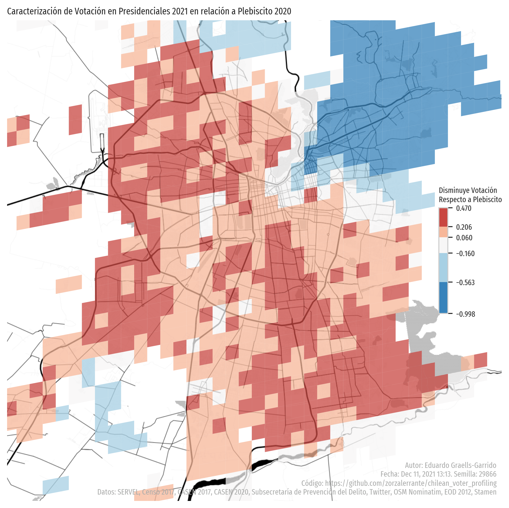

# Perfilamiento del voto en Chile

Notebook y scripts para descargar bases de datos públicas, cruzarlas, y perfilar el voto en las elecciones presidenciales 2021 en Chile.

Este repositorio utiliza la licencia [MIT Anti Fascismo](https://github.com/jamiebuilds/anti-fascist-mit-license).

## Principales Resultados (en Santiago)




## Configuración e Instalación

Se requiere un entorno Linux (en Windows puede ser WSL) o Mac, con `make` y `conda` instalados. Luego de descargar o clonar el repositorio, ejecuta los siguientes comandos:

```sh
# Crea el entorno de conda e instala todo lo necesario (excepto aves)
make conda-create-env
# Instala aves
make install-package

# Descarga los datos :)
make download-external
```

Los análisis están en la carpeta `notebooks`. Puedes ejecutarlos con Jupyter o Visual Studio Code (recomendado) desde el entorno `chilean_voter_profiling` (creado con con los comandos anteriores).